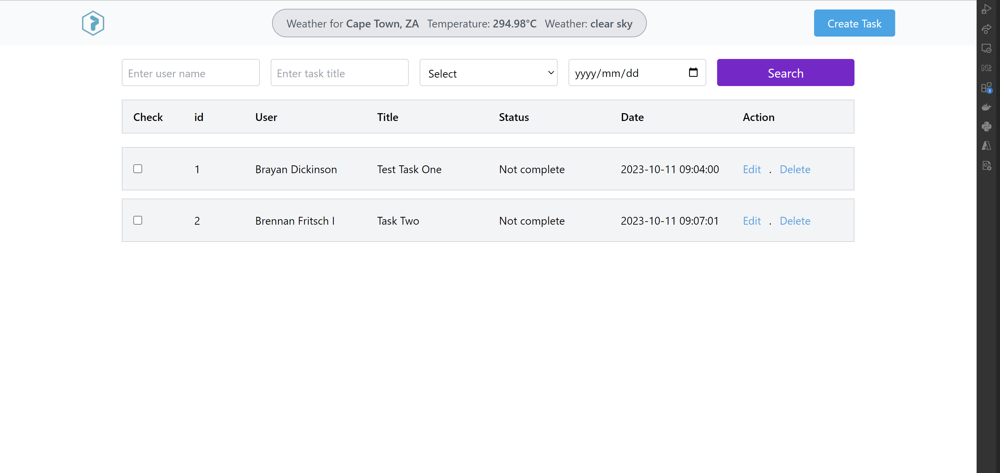

# laravel-task-project

This is a task tracker app, where user can create task and view the tasks on the hom page, they can edit and delete tasks as well as mark tasks as complete. This project serves as a demo project for ekomi

## Tech Stack

**Client:** Laravel, Livewire, TailwindCSS

**Server:** MySQL, Docker

## Screen shots

### home screen




## Installation

To run my this project there are a couple of requirements that you would need. if you are running project on a windows machine you will need Chocolatey so you can install make.


#### Step:1 cmd.exe

```bash
@"%SystemRoot%\System32\WindowsPowerShell\v1.0\powershell.exe" -NoProfile -InputFormat None -ExecutionPolicy Bypass -Command "[System.Net.ServicePointManager]::SecurityProtocol = 3072; iex ((New-Object System.Net.WebClient).DownloadString('https://community.chocolatey.org/install.ps1'))" && SET "PATH=%PATH%;%ALLUSERSPROFILE%\chocolatey\bin"
```
#### Step:2 cmd.exe

```bash
choco install make
```

#### Step:3 clone repo

```bash
git clone https://github.com/MauriceDev1/laravel-task-project.git
```

#### Step:4 run the following make comands

```bash
make setup
make data
```

#### Step:5 run the following make comands

- project project:http://localhost:9000/
- phpmyadmin project:http://localhost:9001/

## Authors

- [@maurice](https://www.github.com/mauriceDev1)